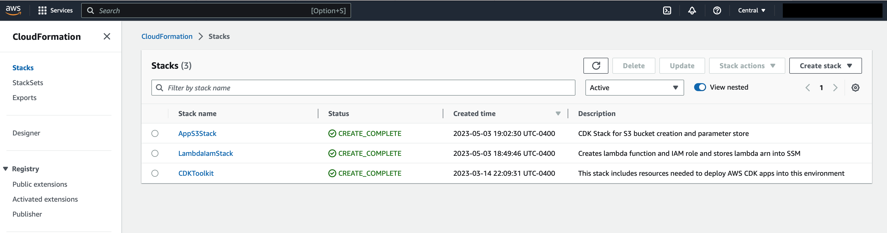
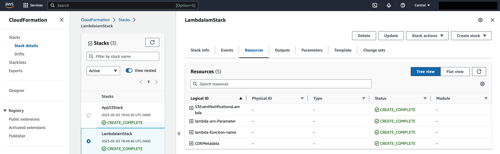

# aws-cdk-event-driven-architecture

A basic serverless architecture developed using cloud development kit (CDK) on Amazon AWS.

## Introduction

Welcome to the Platform Engineering Dojo Event! This project is designed to provide hands-on experience with AWS CDK.
The goal of this DOJO repo is to create CDK project and provide hands-on & learning experience, where individuals or teams can work on real-world problems and develop their skills in a collaborative, immersive setting.


## Meet up Event link
https://www.meetup.com/slalom-tech-talks/events/292976013/?utm_medium=referral&utm_campaign=share-btn_savedevents_share_modal&utm_source=link


### What is this repository for? 

* Quick summary

  This repo is to implement/provision  AWS services of an event driven architecture using AWS CDK as infrastructure as code (IaC)
  This sample CDK project can used as a  generic deployment process for below common business use cases

  - Cloud Platform to store application files and trigger functions and send notification to end users or system
  - Cloud application which process data and save to AWS storage service like S3 and trigger functions and send notifications to downstream systems

  These are couple of use cases but same can be modified to multiple different use cases.

## Getting Started

Clone repository and change to project directory

```bash
cd /path/to/repo
git clone https://arpits2024@bitbucket.org/slalom-consulting/aws-cdk-event-driven-architecture.git #replace it with github https url
cd aws-cdk-event-driven-architecture
```

`Note: Please navigate to pre-requisite directory and refer readme for installation and setup before proceeding.`

## Setting up Stage1 — Creating S3 bucket

The architecture diagram you saw above is divided into four stages. Each stage we deploy certain AWS services/components of our architecture.
Services under each stage will be deployed through respective CDK stack or added in the existing stack.
`Note: CDK Stack creates AWS CloudFormation Stack for it's underlying infrastructure.`

### Components / AWS Services  

- S3 bucket with bucket properties.
- SSM parameter for storing config.

### Code / Configuration for stage1 
This will create s3 bucket and first stack with AWS CDK
```
import {CfnOutput } from 'aws-cdk-lib';
import * as cdk from 'aws-cdk-lib'
import * as iam from 'aws-cdk-lib/aws-iam';
import * as s3 from 'aws-cdk-lib/aws-s3';
import * as ssm from 'aws-cdk-lib/aws-ssm';

export interface LambdaProps extends cdk.StackProps{
  readonly lambdaFunction: lambda.Function;
}

export class AppS3Stack extends cdk.Stack {
  public readonly S3bucket: s3.Bucket;
    constructor(scope: cdk.App, id: string, props: LambdaProps) {
    super(scope, id, props);


    const Apps3Bucket = new s3.Bucket(this, 'exampleBucket', {
      bucketName: `cdk-event-driven-arch-bucket`,
      objectOwnership: s3.ObjectOwnership.BUCKET_OWNER_ENFORCED,
      blockPublicAccess: s3.BlockPublicAccess.BLOCK_ALL,
    });

    Apps3Bucket.grantRead(new iam.AccountRootPrincipal());
    const s3BucketArn = Apps3Bucket.bucketArn;
    const S3bucketName = Apps3Bucket.bucketName;

    new CfnOutput(this, 'exampleBucketArn', {
      value: s3BucketArn,
      description: 'arn of demo app s3 bucket',
    })

    new ssm.StringParameter(this, 'S3bucket-arn-Parameter', {
      allowedPattern: '.*',
      description: 'S3 bucket ARN',
      parameterName: '/dev/s3bucket',
      stringValue: s3BucketArn,
      
      tier: ssm.ParameterTier.ADVANCED,
    });

    new ssm.StringParameter(this, 'S3bucket-name-Parameter', {
      allowedPattern: '.*',
      description: 'S3 bucket Name',
      parameterName: '/dev/s3bucketname',
      stringValue: S3bucketName,

      tier: ssm.ParameterTier.ADVANCED,
    });
  }
}
```

### Bootstrapping
Bootstrapping is the process of provisioning resources for the AWS CDK before you can deploy AWS CDK apps into an AWS environment (which is a combination of AWS account & region)

CDK bootstrap deploy  "CDKToolkit" Stack. This stack includes resources that are used in the toolkit’s operation. For example, the stack includes an S3 bucket that is used to store templates and assets during the deployment process.

Use cdk bootstrap command to bootstrap one or more AWS environments. 
```sh
cdk bootstrap aws://ACCOUNT-NUMBER-1/REGION-1
```

In case AWS PROFILE is defined
```
cdk bootstrap --profile <name of your AWS profile>
```

validate the CDK bootstrap resources details by checking the CDKToolkit stack using AWS Console
 

### Steps to deploy / Provision resources for Stage1

`Note: Before we move on to deploy command steps, cdk will search for cdk.json inorder to run any cdk deploy commands so please make sure you are in the right directory.`

To build this app, you need to be in this example's root folder. Then run the following command.
```
npm install -g aws-cdk
npm install
```

Describe cdk stacks
```sh
cdk ls
```

To synthesize your application and check the cloudformation stack which it is going to create, run the following command.
```
cdk synth <stack name>
```
To deploy your application, run the following
```
cdk deploy <stack name> -r <your role arn>
```

 

### Stage1 Output

Validate the CDK stack deployment by checking the CloudFormation stack from AWS Console

 

As part of stage1 deployment we have deployed 
- S3 stack
- Output of S3 bucket name & ARN save to parameter store

 


## Setting up Stage2 — Creating Lambda and IAM Dependencies
- Since now you are familiar enough with CDK so you can start building the solution putting more AWS resources together. However, if you are already experienced in using cdk, you can skip to coding section.

- First, open the workspace where you created S3 from Stage 1 and create a file under lib/lambda-iam-stack.ts with the following content:

### Componets / AWS Services uses

- Lambda
- IAM
- S3
- Systems parameter

### Code / Configuration update for Stage2

- Go to the lib/lambda-iam-stack.ts file which you created initially.
- Below is the reference code to create lambda and it's IAM permissions using CDK.
```
import * as cdk from 'aws-cdk-lib';
import * as lambda from 'aws-cdk-lib/aws-lambda';
import * as iam from 'aws-cdk-lib/aws-iam';
import { Construct } from 'constructs';
import * as path from 'path';
import * as ssm from 'aws-cdk-lib/aws-ssm';

export class LambdaIamStack extends cdk.Stack {
  public readonly bucketName: string;
  constructor(scope: Construct, id: string, props?: cdk.StackProps) {
    super(scope, id, props);

    const s3bucketarn = ssm.StringParameter.valueForStringParameter(this, '/dev/s3bucket');
    const bucketParamName = ssm.StringParameter.valueForStringParameter(this, '/dev/s3bucketname');
    this.bucketName = bucketParamName

    const fn = new lambda.Function(this, 'S3EventNotificationsLambda', {
      runtime: lambda.Runtime.NODEJS_14_X,
      functionName: 'S3EventNotificationsManager',
      handler: 'manage-s3-event-notifications.handler',
      code: lambda.Code.fromAsset(path.join(__dirname, '../lambda')),
      timeout: cdk.Duration.seconds(300)
    });

    fn.addToRolePolicy(
      new iam.PolicyStatement({
        actions: ['s3:GetBucketNotification', 's3:PutBucketNotification'],
        effect: iam.Effect.ALLOW,
        resources: [ s3bucketarn ]
      })
    );

    const lambdaArn = cdk.Arn.format({
      service: 'lambda',
      resource: 'S3EventNotificationsManager'
    }, this);

    new ssm.StringParameter(this, 'lambda-arn-Parameter', {
      allowedPattern: '.*',
      description: 'lambda bucket ARN',
      parameterName: '/dev/lambda',
      stringValue: lambdaArn,

      tier: ssm.ParameterTier.ADVANCED,
    });
  }
}
```
- Next is to update the main app and create the LambdaIamStack so that it invokes the stack we create above.
- Add below code to bin/pe-dojo-app.ts
```
const sharedStack = new LambdaIamStack(app, 'LambdaIamStack', {
  description: "Creates lambda function and IAM role and stores lambda arn into SSM"
});
```

### Steps to deploy / Provision resources for Stage2

`Note: Before we move on to deploy command steps, cdk will search for cdk.json inorder to run any cdk deploy commands so please make sure you are in the right directory.`

To build this app, you need to be in this example's root folder. Then run the following command.
```
npm install -g aws-cdk
npm install
```
To synthesize your application and check the cloudformation stack which it is going to create, run the following command.
```
cdk synth <stack name>
```
To deploy your application, run the following
```
cdk deploy <stack name> -r <your role arn>
```


### Output

Go to AWS console and check if the cloudformation stack is successfully deployed, Also check if all the resources which we expect to create are created successfully.
- Lambda
- S3
- IAM permissions for lambda





## Setting up Stage3 — Adding S3 Trigger for Lambda
- First, open the workspace where you created S3 from Stage 1 and within the same file under lib/s3-bucket.ts we will add s3 trigger code.

### Componets / AWS Services uses
- S3
- Lambda

### Code / Configuration update for Stage3
- Go to the lib/s3-bucket.ts file which you created initially.
- We will create interface to use lambda object in the s3 stack
```
export interface LambdaProps extends cdk.StackProps{
  readonly lambdaFunction: lambda.Function;
}
```
- Next, we will add s3 trigger to s3 stack. Go to end of the file and copy below code to add trigger.
```
const s3PutEventSource = new lambdaEventSources.S3EventSource(Apps3Bucket, {
    events: [s3.EventType.OBJECT_CREATED_PUT]
});
props.lambdaFunction.addEventSource(s3PutEventSource);
```

### Steps to deploy / Provision resources for Stage3
`Note: Before we move on to deploy command steps, cdk will search for cdk.json inorder to run any cdk deploy commands so please make sure you are in the right directory.`

To build this app, you need to be in this example's root folder. Then run the following command.
```
npm install -g aws-cdk
npm install
```
To synthesize your application and check the cloudformation stack which it is going to create, run the following command.
```
cdk synth <stack name>
```
To deploy your application, run the following
```
cdk deploy <stack name> -r <your role arn>
```


### Output

Go to AWS console and check if the cloudformation stack is successfully deployed, Also check if s3 trigger has been added to Lambda successfully.
- Lambda


### Contribution guidelines

* Review the existing issues and pull requests to avoid duplicating efforts.
* Follow the project's code style and formatting guidelines.
* Write clear and concise commit messages and pull request descriptions.
* Test your changes thoroughly before submitting a pull request.
* Be respectful and professional in all communication and interactions.

### Who do I talk to? ###

* Repo owner  - Slalom Build Platform Engineering Team
