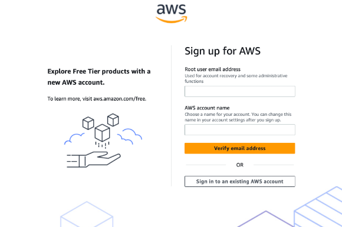
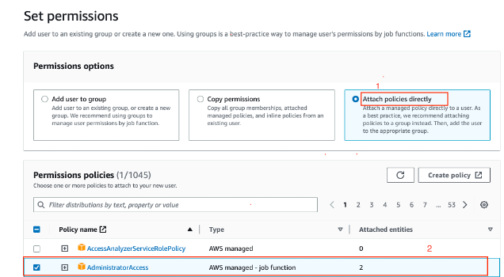
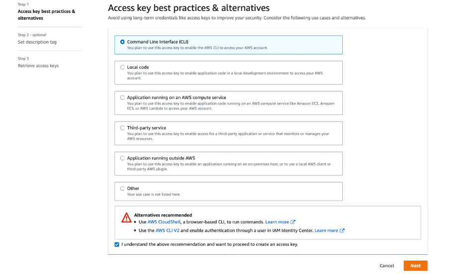

# Setup your own DOJO

### Table of Content
[Setting up AWS console](#awsconsole) <br>
[Setting up Development workspace](#devworkspace) <br>
[Configure AWS Profile to enable access to AWS Resources](#setupprofile) <br>
[Setup AWS Profile to enable access to AWS Resources on VS Code](#vsprofile) <br>
[Installing CDK on Visual Studio Code](#cdkinstall) <br>
[Deploying Resources to test](#deploytest)


### Prerequisites
To set up and secure your new AWS account, you will need the following: <br>
*	A web browser with access to AWS <br>
*	Credit card to set up AWS account <br>
*	A phone number to verify your account setup (AWS will call to finalize setup process) 

## Setting up AWS console<a name="awsconsole"></a>

#### Step 1
Sign-up on AWS management console(free-tier) <br>
Link: [AWS Console](https://aws.amazon.com/console/)

You should see a screen that would take you directly to the screenshot below: <br>


<span style="color:red">Note</span>: To complete the process, you will need to enter a credit card number and receive a phone call from Amazon to enter a code. It will ask you if you want to create a support plan. Just select the free, basic support plan to avoid additional charges. You will have to validate your account by responding to a phone call.


#### Step 2
- Sign in to your new account by clicking <span style="color:red">"Sign in to the Console"</span> at the top of the page. 
- Look at your billing information by clicking on the account name you selected. 
- It will be on the right side of the black bar at the top of the screen. 
- Click on <span style="color:red">"Account"</span>. 

 <br>

This section is where you would set up alternate billing contacts and create challenge questions. <br>


This section allows turning on or off access to billing for anyone but the root user in the account. Large companies may want to consider using AWS Organizations and Consolidated Billing to segregate billing responsibilities into a separate account. For more information about organizations see: [AWS organizations](https://aws.amazon.com/organizations/) 

#### Step 3
##### Secure the Root User
Best practice: AWS best practices include some immediate changes to protect the default root user. These protections are located under the IAM (Identity and Access Management) service in AWS, which allows you to manage access to AWS services in your account. 

#### Step 4
##### Remove API Access Keys
1- Navigate to IAM Service <br>


2- Verify there is a green checkbox next to “Delete your root access keys”<br>


#### Step 5
##### Create an AWS IAM User
<span style="color:green">Best Practice:</span> For AWS IAM include not using the root account but instead setting up a new user and then using separate user accounts for normal operations. Lock away the root account access in a safe manner


1- <span style="color:green">Navigate to the IAM</span> page in the AWS Console. <br>


2- Click on <span style="color:red">"Users"</span> on the left and then click <span style="color:red">"Add user"</span> at the top of the screen.  <br>


Add a new user with the following settings and click <span style="color:red">"Next: Permissions".</span> <br>
<span style="color:blue">Note:</span> Name of the user is <span style="color:red">name-cdk-lab(replace “name” with your name).</span> This is the user account you will be using in the labs to perform actions in your AWS account. Change <span style="color:purple">YourPasswordHere</span> to a password you can remember. Also, be sure a checkmark appears besides <span style="color:red">"AWS Management Console access"</span> and the <span style="color:blue">other checkboxes are empty.</span>

3- <span style="color:green">On the next screen</span>, choose the last box, <span style="color:red">"Attach policies directly"</span>, then select <span style="color:red">"AdministratorAccess"</span>, and finally click <span style="color:red">"Next: Tags."</span> <br>



4- Click <span style="color:red">"Next: Review"</span>, click <span style="color:red">"Create user"</span>, and then click <span style="color:red">"Close." </span> <br>

<span style="color:green">Navigate to the IAM service.</span> Click the AWS logo, search for IAM, and click on IAM. 

5- <span style="color:green">Copy the IAM users sign-in link</span> as you will log in as the new user. Alternatively, you can download the **.csv** file of your credential to your local machine. Hint: You might want to create a bookmark for this link! <br>


6- <span style="color:green">Sign in to your AWS account</span> at the URL in Step 5 with the new user sign-in information. <br>


7- <span style="color:green">You are now logged in as the IAM user you have created! </span> <br>


## Setting up Development workspace(Optional: Cloud9) <a name="devworkspace"></a>
#### Step 1
Install Visual Studio Code
https://code.visualstudio.com

Depending on you Operating system, install visual studio code

#### Step 2
Once Visual Studio Code is installed, Install the Toolkit for VS Code

Start the VS code editor <br>
 i. In the **Activity Bar** on the side of the VS Code editor, choose the **Extensions** icon. <br>
    This opens the **Extensions** view, which allows you to access the VS Code Marketplace. <br>
     <br>
 ii. In the search box for **Extensions**, search for AWS Toolkit. Choose the entry to see its details in the right pane. <br>
 iii.  In the right pane, choose **Install.** <br>
 iv. Once installed, if you're prompted to restart the editor, choose **Reload Required** to finish installation.
    
After you install the Toolkit for VS Code, you should configure your AWS Profile to enable you to access your AWS resources from within VS Code.
## Configure AWS Profile to enable access to AWS Resources <a name="setupprofile"></a>
#### Step 1
Once you have visual studio installed and your development workspace        configure. You must configure AWS Profile to enable access

#### Step 2
Log back into AWS console using your IAM account and create access keys for your AWS CLI


#### Step 3
Make sure Command Line Interface is checked and “I understand the above recommendation and want to proceed to create an access key.” Is also checked, click Next


#### Step 4
Set description tag(optional)Retrieve and download it in your machine, to refer later


Once your access keys are created. <span style="color:red">Do Not share your access keys with anyone</span>

### Setup AWS Profile to enable access to AWS Resources on VS Code <a name="vsprofile"></a>
### Prerequisites
To setup your AWS Profile, which will enable you to deploy resource in your AWS account(without using root), using Visual Studio Code : <br>
*	AWS CLI <br>
*	AWS Profile Keys(retrieved in above steps) <br>
*	Visual Studio Code or Cloud 9

#### AWS CLI
**AWS CLI** - is a tool that allows you to interact and manage your AWS services. This tool allows you to control and provision many AWS services from the command line and automate through scripts

* Windows users: [MSI Installer](https://docs.aws.amazon.com/cli/v1/userguide/install-windows.html#install-msi-on-windows)
* Linux, maxOS or Unix users: [Bundled Installer](https://docs.aws.amazon.com/cli/latest/userguide/cli-chap-getting-started.html#install-bundle-other)

#### AWS Profile Keys

The profile keys should have been downloaded in the above step **(Configure AWS Profile to enable access to AWS Resources)**. If not downloaded in local drive, please repeat the step above to create new keys as they are not retrievable.

#### Visual Studio Code or Cloud 9
This should be already installed, or alternatively you may have used AWS Cloud 9 to setup your development workspace.

### Configure your profile
Step 1 :
```
aws configure --profile name-cdk-lab
```

Step 2:

Fill in the rest information from the console. Keys can be retrieved from the downloaded keys from previous steps **(Configure AWS Profile to enable access to AWS Resources)**


```
AWS Acc_es_s Ke_y ID [None]: <type key ID here>
AWS S_e_cre_t Ac_ce_s_s Key [None]: <type access key>
Default region name [None]: <choose region (e.g. "us-east-1", "eu-west-1")>
Default output format [None]: <leave blank>
```


## Installing CDK on Visual Studio Code <a name="cdkinstall"></a>

Step 1 -  
The AWS CDK uses Node.js, so you must install Node.js in your machine, before proceeding further

To install Node.js visit the node.js website: <br>
Install [Node.js](https://nodejs.org/en/)

Windows: if you have an old version of Node.js installed on your system, it may be required to run the .msi installation as Administrator.

Step 2 -

If you already have Node.js installed, verify that you have a compatible version

```
node --version
```
Output should be >= 10.13.0:
```
v10.3.0
```

Screenshot for reference:

Step 3 -

Install the AWS CDK toolkit. The toolkit is a command line utility which allows you to work with CDK apps

Open the terminal session and run the following command:

```
npm install -g aws-cdk
```

Confirm and check toolkit version:
```
$ cdk --version
2.0.0 (build 4b6ce31)
```
Screenshot for reference:


## CDK Supports below languages 

* TypeScript
* Python
* .NET
* JAVA
* Go

## Sample CDK Project to get started

Create your project directory 

e.g - CDK-DOJO
```
mkdir CDK-DOJO && cd CDK-DOJO
```

CDK init - use cdk init to create a new TypeScript CDK project.

```
cdk init sample-app --language typescript
```
This will help to get started with default CDK typescript prject directory structure.
